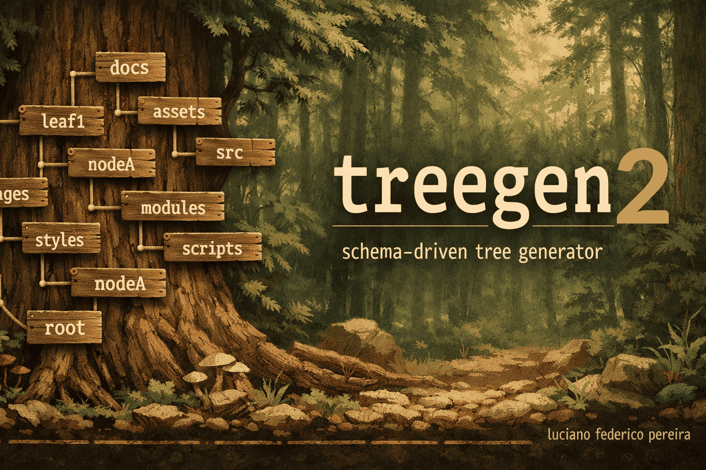
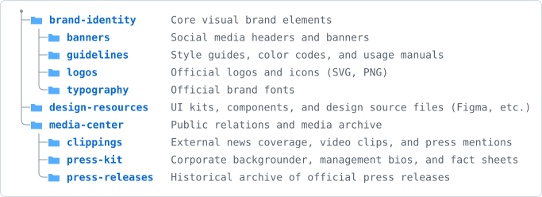
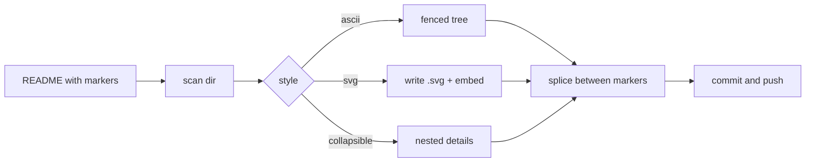

# 🌳 treegen2

## File Tree README Action, in Perl

<h2><a href='https://lucianofedericopereira.github.io/treegen2/' alt='read docs'>
        
        Read Docs
</a></h2>

[](https://github.com/lucianofedericopereira/treegen2/actions/workflows/ci.yml)
[](LICENSE)
[](bin/treegen2)
[](lib/Treegen2)

Drop a `[[files]]` marker into any Markdown file and let this GitHub Action
replace it with a directory tree. Choose the look:

- **`ascii`** — the classic `tree` block, with optional aligned descriptions.
- **`svg`** — a crisp SVG with folder icons that **matches GitHub's light/dark
  theme** and scales responsively.
- **`collapsible`** — a GitHub-native, expand/collapse `<details>` tree.

`treegen2` is a from-scratch, line-for-line reimplementation of
[`treegen`](https://github.com/lucianofedericopereira/treegen) — same
markers, same options, same output — written in pure, core-only **Perl**
instead of pure-stdlib Python. No CPAN dependencies, no interpreter
setup step, and (see below) a much longer warranty on "still works."

---

## 🕰️ Why Perl, and why this exists

`treegen` v1 works well and isn't going anywhere. `treegen2` exists to answer
a different question: **what does a GitHub Action look like if you optimize
for it still working, completely unmodified, twenty years from now?**

Perl 5 has kept one promise since 1994 harder than almost any other
mainstream language: it does not break your code. A script written for
Perl 5.8 — the version that was current in 2006 — still runs today on
Perl 5.40 without a single edit. There was no ecosystem-splitting "Perl 3"
migration, no multi-year window where half the libraries only worked on the
old interpreter and half only on the new one. The language changed by
addition, not by breaking what already worked.

Python's stdlib-only design is exactly what made v1 elegant — but Python
itself does not carry that same guarantee. The Python 2 → 3 transition took
the ecosystem the better part of a decade to fully cross, and stdlib APIs
still shift under `DeprecationWarning` between minor versions. That's a fine
trade for most software. It's a strange trade for a piece of glue code you
drop into a CI pipeline and then never think about again.

So `treegen2` is built to the older, stricter standard:

- **Pure core Perl.** Every module under `lib/Treegen2/` uses only what
  shipped in Perl's standard distribution — `strict`, `warnings`,
  `Getopt::Long`, `File::Find`, `File::Spec`, `File::Glob`, `Cwd`,
  `File::Path`, `File::Basename`, `File::Temp`, `Test::More`, `Exporter`.
  No `cpanm install`, no lockfile, no supply chain to audit. Even the JSON
  reader for `.filetree.json` descriptions is hand-rolled
  ([`lib/Treegen2/JSONLite.pm`](lib/Treegen2/JSONLite.pm)) rather than
  pulled in from `JSON::PP`, which only became a core module in Perl 5.14
  (2011) — after the ~20-year line this project holds itself to.
- **No Perl-5.10-and-up syntax sugar.** No `//` defined-or, no named regex
  captures, no `say`. Nothing here requires an interpreter newer than
  Perl 5.8 (2002–2006). That's a deliberate constraint, not an oversight —
  see [`t/`](t) and the CI matrix below, which actually runs this exact,
  unmodified source on Perl 5.8 through whatever is newest today.
- **No interpreter setup step.** GitHub-hosted runners — Linux, macOS,
  and Windows — ship a system Perl. `action.yml` never runs the Perl
  equivalent of `actions/setup-python`; there's nothing to provision.

CI backs this up instead of just asserting it. The `time-travel` job in
[`.github/workflows/ci.yml`](.github/workflows/ci.yml) runs the full test
suite, unmodified, inside official `perl:5.8`, `5.10`, `5.14`, `5.20`,
`5.26`, `5.32`, `5.36`, and `latest` containers on every push — the same
`t/*.t` files, the same `lib/`, no branching on version. If that job is
green, this code just proved it spans two decades of the language without
a single `if $] >= 5.xxx`.

None of this is a criticism of `treegen` v1 — it's a genuinely good tool for
people already living in a Python-shaped world. `treegen2` is for the other
case: repos where you want the dependency that outlives the framework
churn around it.

---

## ✨ Demo

All three trees below are generated from [`examples/brand`](examples/brand)
by this very action. Edit the folders, push, and they update themselves.

### `ascii`

<!-- filetree:start dir="examples/brand" descriptions="examples/brand/.filetree.json" exclude=".filetree.json" dirs-only="true" -->
```
├── brand-identity/      # Core visual brand elements
│   ├── banners/         # Social media headers and banners
│   ├── guidelines/      # Style guides, color codes, and usage manuals
│   ├── logos/           # Official logos and icons (SVG, PNG)
│   └── typography/      # Official brand fonts
├── design-resources/    # UI kits, components, and design source files (Figma, etc.)
└── media-center/        # Public relations and media archive
    ├── clippings/       # External news coverage, video clips, and press mentions
    ├── press-kit/       # Corporate backgrounder, management bios, and fact sheets
    └── press-releases/  # Historical archive of official press releases
```
<!-- filetree:end -->

### `svg` (folder icons · GitHub light/dark · responsive)

<!-- filetree:start dir="examples/brand" descriptions="examples/brand/.filetree.json" exclude=".filetree.json" dirs-only="true" style="svg" svg-output="assets/example-tree.svg" title="Brand assets" -->

<!-- filetree:end -->

### `collapsible`

<!-- filetree:start dir="examples/brand" descriptions="examples/brand/.filetree.json" exclude=".filetree.json" style="collapsible" -->
<details open>
<summary><span class="ft-name">📁 <strong>brand-identity</strong></span> <em class="ft-note">Core visual brand elements</em></summary>
  <details open>
  <summary><span class="ft-name">📁 <strong>banners</strong></span> <em class="ft-note">Social media headers and banners</em></summary>
    <ul>
      <li><span class="ft-name">📄 twitter-header.png</span></li>
    </ul>
  </details>
  <details open>
  <summary><span class="ft-name">📁 <strong>guidelines</strong></span> <em class="ft-note">Style guides, color codes, and usage manuals</em></summary>
    <ul>
      <li><span class="ft-name">📄 brand-guide.pdf</span></li>
    </ul>
  </details>
  <details open>
  <summary><span class="ft-name">📁 <strong>logos</strong></span> <em class="ft-note">Official logos and icons (SVG, PNG)</em></summary>
    <ul>
      <li><span class="ft-name">📄 favicon.png</span></li>
      <li><span class="ft-name">📄 logo-mono.svg</span></li>
      <li><span class="ft-name">📄 logo-primary.svg</span></li>
    </ul>
  </details>
  <details open>
  <summary><span class="ft-name">📁 <strong>typography</strong></span> <em class="ft-note">Official brand fonts</em></summary>
    <ul>
      <li><span class="ft-name">📄 Inter-Bold.ttf</span></li>
      <li><span class="ft-name">📄 Inter.ttf</span></li>
    </ul>
  </details>
</details>
<details open>
<summary><span class="ft-name">📁 <strong>design-resources</strong></span> <em class="ft-note">UI kits, components, and design source files (Figma, etc.)</em></summary>
  <ul>
    <li><span class="ft-name">📄 components.fig</span></li>
    <li><span class="ft-name">📄 ui-kit.fig</span></li>
  </ul>
</details>
<details open>
<summary><span class="ft-name">📁 <strong>media-center</strong></span> <em class="ft-note">Public relations and media archive</em></summary>
  <details open>
  <summary><span class="ft-name">📁 <strong>clippings</strong></span> <em class="ft-note">External news coverage, video clips, and press mentions</em></summary>
    <ul>
      <li><span class="ft-name">📄 techcrunch-feature.md</span></li>
    </ul>
  </details>
  <details open>
  <summary><span class="ft-name">📁 <strong>press-kit</strong></span> <em class="ft-note">Corporate backgrounder, management bios, and fact sheets</em></summary>
    <ul>
      <li><span class="ft-name">📄 company-backgrounder.pdf</span></li>
    </ul>
  </details>
  <details open>
  <summary><span class="ft-name">📁 <strong>press-releases</strong></span> <em class="ft-note">Historical archive of official press releases</em></summary>
    <ul>
      <li><span class="ft-name">📄 2025-01-product-launch.md</span></li>
      <li><span class="ft-name">📄 2025-06-series-a.md</span></li>
    </ul>
  </details>
</details>
<!-- filetree:end -->

---

## 🚀 Quick start

**1. Add a placeholder** anywhere in your `README.md`:

```markdown
## Project structure

[[files]]
```

**2. Add a workflow** at `.github/workflows/update-tree.yml`:

```yaml
name: Update file tree
on:
  push:
    branches: [main]
permissions:
  contents: write        # so the action can push the updated README
jobs:
  update:
    runs-on: ubuntu-latest
    steps:
      - uses: actions/checkout@v4
      - uses: lucianofedericopereira/treegen2@v1
        with:
          style: ascii    # ascii | svg | collapsible
```

On the next push the `[[files]]` token is expanded into a managed block that
is kept in sync on every run:

````markdown
<!-- filetree:start -->
```
├── src/
│   └── app.py
└── README.md
```
<!-- filetree:end -->
````

> You never edit between the markers — the action owns that region.

---

## 🎛️ Per-marker options

The default style comes from the workflow, but any marker can override it
with inline attributes. Both the `[[files …]]` placeholder and the
`<!-- filetree:start … -->` marker accept the same attributes:

```markdown
[[files dir="src" style="svg" max-depth="3" dirs-only="true"]]
```

| Attribute       | Aliases              | Example                 | Meaning                                            |
| --------------- | --------------------- | ----------------------- | -------------------------------------------------- |
| `dir`           | `path`, `directory`  | `dir="src"`             | Directory to scan (relative to repo root).         |
| `style`         |                       | `style="svg"`           | `ascii`, `svg`, or `collapsible`.                  |
| `max-depth`     | `depth`               | `max-depth="2"`         | Limit tree depth (`0` = unlimited).                |
| `dirs-only`     |                       | `dirs-only="true"`      | Show directories only, hide files.                 |
| `exclude`       | `ignore`              | `exclude="dist,*.tmp"`  | Extra ignore patterns (`.gitignore` syntax).       |
| `use-gitignore` | `gitignore`           | `use-gitignore="false"` | Respect the repo's root `.gitignore` (default on). |
| `show-root`     | `root`                | `show-root="true"`      | Include the scanned directory itself.              |
| `descriptions`  | `desc`                | `desc="tree.json"`      | JSON file of `path → comment` notes.               |
| `svg-output`    | `svg`, `output`       | `svg="docs/tree.svg"`   | Where the SVG file is written (svg style).         |
| `color`         | `colour`              | `color="green"`         | SVG folder colour (see palette below).             |
| `title`         |                       | `title="Layout"`        | Summary / alt-text label.                          |
| `collapse`      |                       | `collapse="true"`       | Wrap the block in one top-level `<details>`.       |
| `open`          |                       | `open="false"`          | Render collapsibles closed by default.             |

Markers and placeholders inside fenced code blocks or `inline code` are left
untouched, so you can safely document the syntax in the same file (this
README does exactly that).

### 🎨 SVG colours

The `svg` style takes a `color`, macOS-label style. The default **`github`**
matches GitHub's own folder colour (Primer blue) and is theme-aware:

`github` (default) · `blue` · `green` · `red` · `orange` · `yellow` ·
`purple` · `pink` · `gray`

```markdown
<!-- filetree:start dir="src" style="svg" color="green" -->
<!-- filetree:end -->
```

Each colour ships a light **and** dark variant, so it adapts to the reader's
theme automatically.

---

## 📝 Descriptions (the `# comments`)

Point `descriptions` at a JSON file mapping paths (relative to the scanned
directory) to a short note:

```json
{
  "brand-identity": "Core visual brand elements",
  "brand-identity/logos": "Official logos and icons (SVG, PNG)"
}
```

Notes render as aligned `# comments` in `ascii`, muted trailing text in
`svg`, and italic suffixes in `collapsible`. The reader
([`lib/Treegen2/JSONLite.pm`](lib/Treegen2/JSONLite.pm)) is a small
hand-written JSON parser, not a CPAN module — see [Why Perl](#why-perl-and-why-this-exists).

---

## ⚙️ Action inputs

Every input has a sensible default; the smallest useful config is just
`uses: lucianofedericopereira/treegen2@v1`.

| Input                | Default                                        | Description                                        |
| --------------------- | ----------------------------------------------- | --------------------------------------------------- |
| `readme`              | `README.md`                                     | File(s) to update. Comma/newline separated, globs. |
| `directory`           | `.`                                             | Default scan directory.                            |
| `style`               | `ascii`                                         | Default style.                                     |
| `max-depth`           | `0`                                              | Default depth limit.                               |
| `dirs-only`           | `false`                                          | Directories only.                                  |
| `exclude`             | _(empty)_                                       | Extra ignore patterns.                             |
| `use-gitignore`       | `true`                                           | Respect root `.gitignore`.                         |
| `show-root`           | `false`                                          | Include the scanned root.                          |
| `descriptions`        | _(empty)_                                       | Path to a descriptions JSON.                       |
| `svg-output`          | `assets/filetree.svg`                           | SVG asset path.                                    |
| `color`               | `github`                                         | SVG folder colour (`github` matches GitHub).       |
| `title`               | `Project structure`                             | Summary / alt text.                                |
| `collapse`            | `false`                                          | Wrap blocks in `<details>`.                        |
| `open`                | `true`                                           | Collapsibles start open.                           |
| `placeholder`         | `files`                                          | Token name → `[[files]]`.                          |
| `format`              | `auto`                                           | `auto` \| `markdown` \| `html` (html for `.html`).  |
| `expand-placeholders` | `true`                                           | Set `false` for HTML pages that document `[[…]]`.  |
| `check`               | `false`                                          | Fail if out of date; never writes.                 |
| `commit`              | `true`                                           | Commit & push the changes.                         |
| `commit-message`      | `docs: update file tree [skip ci]`              | Commit message.                                    |
| `commit-user-name`    | `github-actions[bot]`                           | Commit author name.                                |
| `commit-user-email`   | `github-actions[bot]@users.noreply.github.com`  | Commit author email.                               |

**Outputs:** `changed` — `'true'` if anything was updated. `blocks` — total
number of tree blocks (re)generated.

Notice what's *not* there: no `python-version` (or `perl-version`) input.
There's no interpreter to pin — see [Why Perl](#why-perl-and-why-this-exists).

### CI "check" mode

Fail a pull request when the README is stale instead of committing:

```yaml
- uses: lucianofedericopereira/treegen2@v1
  with:
    check: "true"
    commit: "false"
```

---

## 💻 Local usage

No install needed — it's core Perl only:

```bash
git clone https://github.com/lucianofedericopereira/treegen2
cd treegen2
perl bin/treegen2 --readme README.md --style svg --dir src
# preview without writing:
perl bin/treegen2 --readme README.md --check
```

Run `perl bin/treegen2 --help` for every flag (or see the
[per-marker options](#per-marker-options) table above — the CLI flags and
marker attributes mirror each other).

---

## 🔍 How it works

1. **Scan** the directory into a tree, honouring `.gitignore` and excludes
   ([`lib/Treegen2/Scanner.pm`](lib/Treegen2/Scanner.pm),
   [`lib/Treegen2/Ignore.pm`](lib/Treegen2/Ignore.pm)).
2. **Render** it with the chosen style
   ([`lib/Treegen2/Renderer/`](lib/Treegen2/Renderer)) — `svg` also writes an
   `.svg` file and embeds it as a responsive Markdown image; GitHub strips
   *inline* `<svg>`, so a referenced file is the reliable, theme-aware route.
3. **Splice** the result between the `filetree` markers, idempotently
   ([`lib/Treegen2/Readme.pm`](lib/Treegen2/Readme.pm)).
4. **Commit** the changes back (optional, handled by `action.yml`).



---

## 🛠️ Development

```bash
git clone https://github.com/lucianofedericopereira/treegen2
cd treegen2
prove -Ilib -r t     # run the test suite (Test::More, no CPAN needed)
```

There's no build step, no lockfile, and no virtualenv to activate — `prove`
and `perl` are enough. The CI workflow additionally syntax-checks every
module (`perl -c`) and runs the same suite across the Perl-version matrix
described in [Why Perl](#why-perl-and-why-this-exists).

The project layout (kept fresh by treegen2 itself):

<!-- filetree:start dir="lib" style="ascii" show-root="true" -->
```
lib/
├── Treegen2/
│   ├── Renderer/
│   │   ├── Ascii.pm
│   │   ├── Collapsible.pm
│   │   └── Svg.pm
│   ├── CLI.pm
│   ├── Config.pm
│   ├── Descriptions.pm
│   ├── Escape.pm
│   ├── Ignore.pm
│   ├── JSONLite.pm
│   ├── Model.pm
│   ├── Readme.pm
│   ├── Renderer.pm
│   └── Scanner.pm
└── Treegen2.pm
```
<!-- filetree:end -->

---

## 🏪 Publishing to the GitHub Marketplace

The action is Marketplace-ready: [`action.yml`](action.yml) lives at the
repo root with a `name`, `description`, and `branding` (icon + colour).

1. Push the repo **public**.
2. Create a release — tag it `v1.0.0`. On the release page, tick **"Publish
   this Action to the GitHub Marketplace"**, accept the agreement, and
   choose categories (e.g. _Utilities_, _Continuous integration_).
3. Move a floating **`v1`** tag to the release so consumers can pin
   `uses: lucianofedericopereira/treegen2@v1`:

   ```bash
   git tag -fa v1 -m "treegen2 v1" && git push origin v1 --force
   ```

> Marketplace requires the action **`name`** to be unique across all
> listings. If the current name in `action.yml` is taken, tweak it.

---

## 📄 License

[MIT](LICENSE) © [Luciano Federico Pereira](https://github.com/lucianofedericopereira)
— do whatever you like; attribution appreciated.
